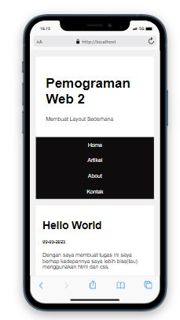

# Tugas-Pertemuan-2-Pemograman-Web-2-membuat-layout-sederhana

Assalam'mulaikum wr wb. 
 

Di tugas kali ini saya akan membagikan sedikit shering mengenai program membuat layout sederhana menggunakan html dan css, tampa berlama lama lagi saya kan mesering foto hasil output programnya.

1. Tampilan program jiga di dekstop(komputer)

2. Tampilan program jiga di mobile(Henpone)

Oke jika kalian penasaran kalian bisa mencobanya langsung dengan scrip coding di file atas dan maaf jika saya belum bisa menjelaskan setep baiytep codingnya karna kurangnya, ilmu saya tapi inssayallah untuk kedepannya saya akan meningkatkannya terimakasih telah membaca hingga titik ini kurang lebih saya mohon maaf.

Assalam'mualaikum wr wb

